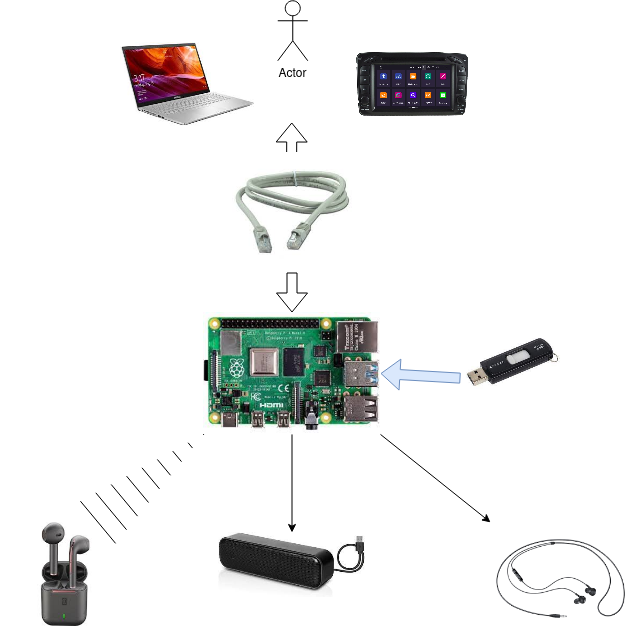

# meta-mediaPlayer

This is a Yocto project layer based on **vsomeip** & **Gstreamer** libraries. Clone this layer under the **poky reference** directory.

#**Explaining the meta-mediaPlayer layer:**

 

For more informations about the someip service check:

**https://gitlab.abinsula.com/abinsula-rd/some-ip/mediaplayer**

***************************************************************************************************************************************
***************************************************************************************************************************************
***************************************************************************************************************************************


Building an image using this layer for the **Raspberry Pi4** platform requires some other layers in order for this image to be built properly. This is the layers tree that should be used:

 

#**Setting up the Yocto Project environment and preparing the layers:**

**1-Install the required packages:**

```sudo apt-get install gawk wget git-core diffstat unzip texinfo gcc-multilib build-essential chrpath socat libsdl1.2-dev xterm```

**2-Cloning Poky reference distribution:**

```git clone --branch hardknott git://git.yoctoproject.org/poky```
```cd pokyd```

**3-Clone the openembedded layer:**

```git clone --branch hardknott https://github.com/openembedded/meta-openembedded```

**4-Clone the raspberrypi layer:**

```git clone git clone --branch hardknott git://git.yoctoproject.org/meta-raspberrypi```

**5-Clone this layer "meta-mediaPlayer":**

```git clone git@gitlab.abinsula.com:abinsula-rd/some-ip/mediaplayer.git```

**6- Initialize the build environment in the poky directory:**

```	source oe-init-build-env media_build```

**7- Add layers to bitbake layers:**

```bitbake-layers add-layer ~/poky/meta/```

```bitbake-layers add-layer ~/poky/meta-poky/```

```bitbake-layers add-layer ~/poky/meta-yocto-bsp/```

```bitbake-layers add-layer ~/poky/meta-openembedded/meta-oe/```

```bitbake-layers add-layer ~/poky/meta-clang/```

```bitbake-layers add-layer ~/poky/meta-python2/```

```bitbake-layers add-layer ~/poky/meta-openembedded/meta-multimedia/```

```bitbake-layers add-layer ~/poky/meta-openembedded/meta-python/```

```bitbake-layers add-layer ~/poky/meta-openembedded/meta-networking/```

```bitbake-layers add-layer ~/poky/meta-raspberrypi/```

```bitbake-layers add-layer ~/poky/meta-media/```

**8- Check if the layers are correctly added:**

```	bitbake-layers show-layers```

You should see something like this:

 

**9- Open poky/qemubuild/conf/local.conf and add these lignes:**
```
DISTRO_FEATURES_append = " systemd"

DISTRO_FEATURES_BACKFILL_CONSIDERED += "sysvinit"

VIRTUAL-RUNTIME_init_manager = "systemd"

VIRTUAL-RUNTIME_initscripts = "systemd-compat-units"

IMAGE_FEATURES +="eclipse-debug tools-sdk dev-pkgs debug-tweaks"

EXTRA_IMAGE_FEATURES +="ssh-server-openssh"

IMAGE_INSTALL_append = " \
                 cronie \
                 libgstaudio-1.0-0 \
                 libgstaudio-1.0 \
                 nano \
                 vim \
                 bash \
                 i2c-tools \
                 rsync \
                 ${WEB_SERVER_UTILS} \
                 ${VIDEO_TOOLS} \
                 "

WEB_SERVER_UTILS = " \
		   lighttpd \
                   lighttpd-module-fastcgi \
                   "
                   
VIDEO_TOOLS = " \
            gstreamer1.0 \
            gstreamer1.0-plugins-good \ 
            gstreamer1.0-plugins-base \ 
            gstreamer1.0-plugins-ugly \
            gstreamer1.0-libav \
            gst-player \
            gstreamer1.0-meta-base \
            gst-examples \
            gstreamer1.0-rtsp-server \
            vlc \
           "
```
Set the target machine:

```MACHINE ??= "raspberrypi4-64"```

**10- Now we can build our custom image by running: (this can take several hours, for me it took 3~4 hours depending on the building machine):**

Go to ~/poky/media_build and execute:

```bitbake rpi-server-image```

**Attention!** When building the image many errors may occure these are some of the errors and how to repair them:

comment line 174  in optiobal_reference_spec.hpp

Put heder files under :

~/poky/media_build/tmp/work/cortexa72-poky-linux/media/0.1-n0/recipe-sysroot/usr/include

Adding of headers files (gst files in yocto is completly empty copied headers from local system)
 
While integrating the vsomeip recipe an including error appears sol: change line 167 in CMakelists to :

if (${VSOMEIP_BOOST_VERSION} GREATER 107500)

message( ERROR "boost version ${VSOMEIP_BOOST_VERSION} is not (yet) supported. Latest supported version is 1.75.0" )


**11- When the bitbake is completed go to ~/poky/media_build/tmp/deploy/images/raspberrypi4-64**

**12- To write the rpi image to an sd card:**

```sudo bmaptool copy rpi-server-image-raspberrypi4-64.wic.bz2 /dev/sdb```


***************************************************************************************************************************************
***************************************************************************************************************************************
***************************************************************************************************************************************

 

